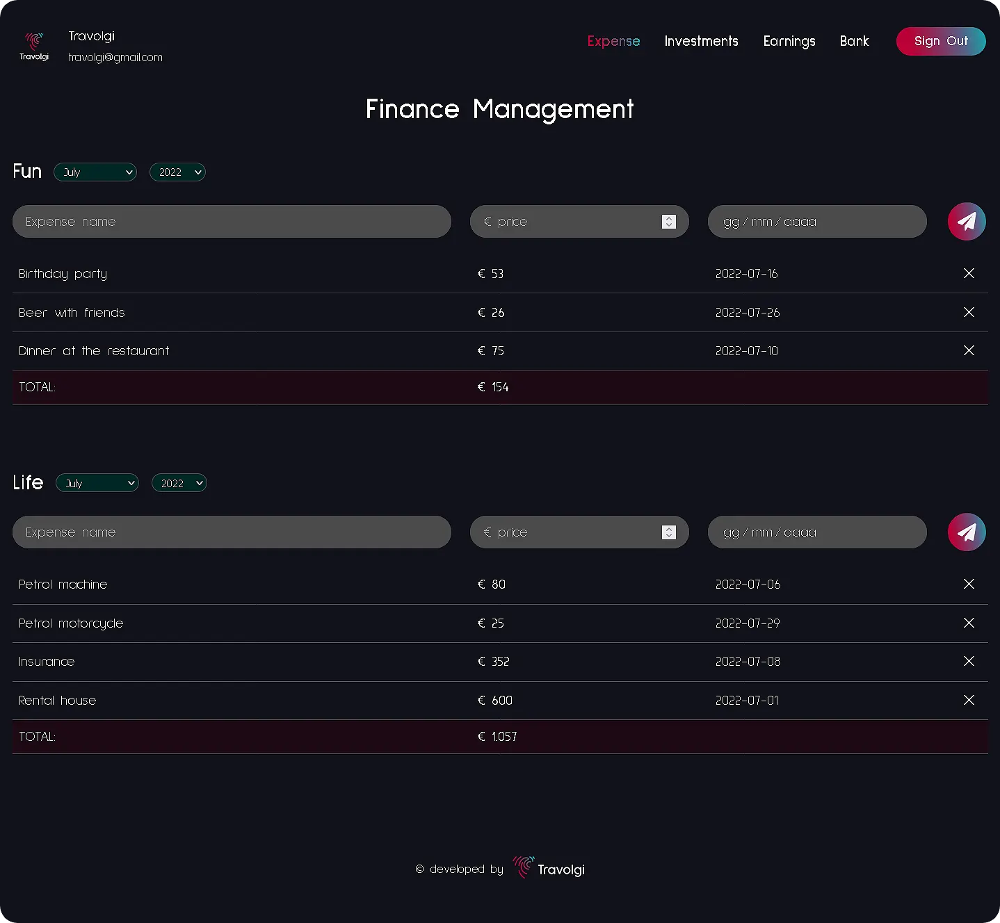

# Finance Management App

[](https://app.netlify.com/sites/finance-management/deploys)

This application helps you keep track of your expenses and earnings from month to month by calculating their total.  
By keeping track of all your expenses and earnings, you realize where your money is going and how your finance is going.

<em>Work in progress...</em>



## Table of contents

- [Overview](#overview)
  - [About App](#about-app)
  - [Links](#links)
- [My process](#my-process)
  - [Built with](#built-with)
  - [Useful resources](#useful-resources)
- [Getting Started](#getting-started)
  - [System Requirements](#system-requirements)
  - [Installation](#installation)
  - [Bugs](#bugs)
  - [Contributing](#contributing)
- [Author](#author)
- [Licence](#licence) 

## Overview

### About App

This application helps you keep track of your finances:

- sign in securely with your Google account
- choose the page that best suits your expense or earning (Expense: Fun - Life, Investments, Earnings, Bank)
- enter the name of your expense or earning, the amount and the date
- delete an expense or a earning
- edit an expense or a earning
- see the total of your expenses or your earnings for the month
- filter by month and year and see your current expenses or your earnings
- see the complete list of your expenses or earnings for the whole year
- month and year filtering by checking the data in the database and showing only the dates present
- summary page to see the difference between expenses and earnings with a selection of items to filter

Upcoming Features:
- graphical reports and diagrams based on the summary result - coming soon
- ascending - descending order based on date
- if you have other interesting features to propose or request write to us!

### Links

- Repository URL: [github](https://github.com/travolgi/react-firebase-finance-management)
- Live Site URL: [live site](https://finance.travolgi.com)

## My process

### Built with

- Semantic HTML5 markup
- CSS custom properties
- Grid and Flexbox layout
- [React](https://reactjs.org) - JS library
- [React Router](https://reactrouter.com) - For routes
- [Firebase](https://firebase.google.com) - Realtime Database

### Useful resources

- [React](https://reactjs.org/docs/getting-started.html) - Docs
- [React Router](https://reactrouter.com/docs/en/v6) - Docs
- [Firebase](https://firebase.google.com/docs) - Docs

## Getting Started

In order to view this project locally, you need to make sure you clone this repository and install it's dependencies.

### System Requirements

- [git](https://git-scm.com) 2.31.1 or greater
- [node](https://nodejs.org/en) 14.16.1 or greater
- [npm](https://nodejs.org/en) 8.7.0 or greater

To check which versions you have installed you can run these commands:
```
git --version
node --version
npm --version
```
If requirements above are not installed in your computer, you'll need to install them. By clicking on them you can go to their website, which can lead you the way.

### Installation

- Clone the repository
  ```sh
  git clone https://github.com/travolgi/react-firebase-finance-management.git
  ```
- Navigate to repository folder
  ```sh
  cd react-firebase-finance-management
  ```
- Install npm packages
  ```sh
  npm install
  ```
- To run the app in the development mode run in the project directory: 
  ```sh
  npm start
  ```

### Bugs

Please feel free to create an issue if you see a bug or something unexpected in the app.

### Contributing

- Fork the Project
- Create your Feature Branch (`git checkout -b feature/yourFeature`)
- Commit your Changes (`git commit -m 'Brief explanation of feature`')
- Push to the Branch (`git push origin feature/yourFeature`)
- Open a Pull Request

## Author

- Website - [travolgi](https://travolgi.com)
- Github - [travolgi](https://github.com/travolgi)

## Licence 
[MIT licence](https://github.com/travolgi/react-firebase-finance-management/blob/main/LICENSE)

React is [MIT licence](https://github.com/facebook/react/blob/main/LICENSE)
